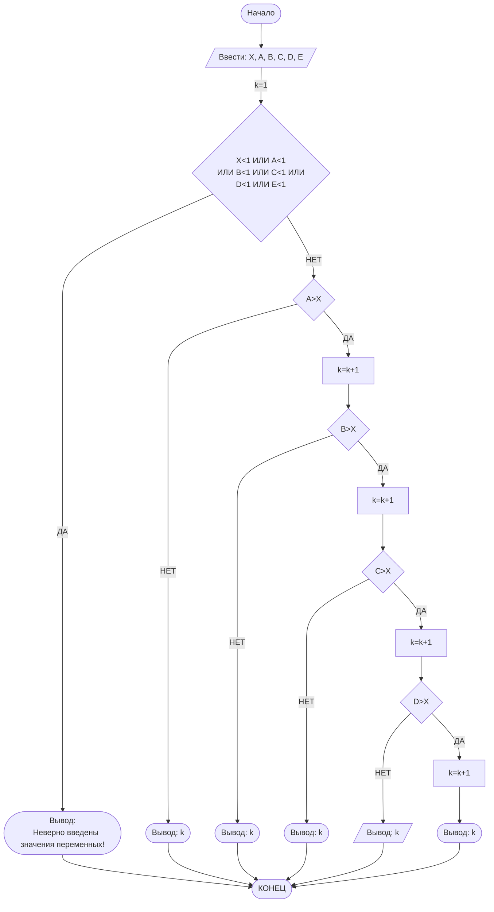

## Отчет по лабораторной работе № 1

#### № группы: `ПМ-2402`

#### Выполнил: `Лапин Владимир Евгеньевич`

#### Вариант: `15`

### Cодержание:

- [Постановка задачи](#1-постановка-задачи)
- [Входные и выходные данные](#2-входные-и-выходные-данные)
- [Выбор структуры данных](#3-выбор-структуры-данных)
- [Алгоритм](#4-алгоритм)
- [Программа](#5-программа)
- [Анализ правильности решения](#6-анализ-правильности-решения)

### 1. Постановка задачи
>Набор из пяти доминошек с высотами A, B, C, D, E устанавливают на
расстоянии X друг от друга в указанном порядке. После этого крайнюю
доминошку (высоты A) роняют в направлении других доминошек. Какое
количество доминошек упадет в результате? Считать, что доминошки имеют нулевую толщину и что доминошка упадет, если её коснется предыдущая. На вход программы подаются натуральные числа X, A, B, C, D, E.
 >
 - Данную задачу можно разложить на две подзадачи :

    1.Сравнение длинны доминошки и расстояния X ;

    2.Подсчет упавших домино ;
### 2. Входные и выходные данные

#### Данные на вход

На вход программа должна получать 6 чисел, при этом в условии сказано, что все переменные относятся к множеству натуральных чисел. Поэтому обозначем все переменные за целые числа (int).
|             | Тип                | min значение    | max значение   |
|-------------|--------------------|-----------------|----------------|
| X (Число 1) | Целое число |       1         |        ?       |
| A (Число 2) | Целое число |       1         |        ?       |
| B (Число 2) | Целое число |       1         |        ?       |
| C (Число 2) | Целое число |       1         |        ?       |
| D (Число 2) | Целое число |       1         |        ?       |
| E (Число 2) | Целое число |       1         |        ?       |
#### Данные на выход

Т.к. программа должна вывести количество упавших домино, то на выход мы получим
единственное целое неотрицательное число.

|         | Тип                                | min значение | max значение   |
|---------|------------------------------------|--------------|----------------|
| k (Число 1) |  Целое число                       |       1      |   ?        |

### 3. Выбор структуры данных

Программа получает 6 целых неотрицательных чисел. Поэтому для их хранения
можно выделить 6 переменных (`X`,`A`,`B`,`C`,`D`,`E`) типа `int`.

|             | название переменной | Тип (в Java) | 
|-------------|---------------------|--------------|
| X (Число 1) | `X`                 | `int`     |
| A (Число 2) | `A`                 | `int`     | 
| B (Число 3) | `B`                 | `int`     |
| C (Число 4) | `C`                 | `int`     |
| D (Число 5) | `D`                 | `int`     |
| E (Число 6) | `E`                 | `int`     |

Для вывода результата можно ввести переменную `k` равную `1` (счетчик).

|             | название переменной | Тип (в Java) | 
|-------------|---------------------|--------------|
| k (Число 7) | `k`                 | `int`     |

### 4. Алгоритм

#### Алгоритм выполнения программы:

1. **Ввод данных:**  
   Программа считывает шесть целых чисел, обозначенных как `X`,`A`,`B`,`C`,`D`,`E`.А такжы мы вводим переменную `k` выступающую в качестве счетчика.
2. **Проверка на соблюдение оганичения:**  
   Если хотя бы одна из введенных переменных `X`,`A`,`B`,`C`,`D`,`E` меньше `1`, то выводится надпись `"Неверно введены значения переменных!"`.
3. **Проверка на соблюдение всеми переменными условия падения и задевания соседней доминошки:**  
    Если переменная `A` больше расстояния `X`, то к количеству упавших домино добавляется `1` и начинается проверка следующей переменной ,иначе выводится предыдущее значение `k`.По такому же алгоритму проверяются все переменные до `D` включительно(значение переменной `E` можно не учитывать тк она стоит последняя в ряду)
4. **Вывод результата:**  
   На экран выводится либо сообщение о неправельно введеных значениях либо количество упавших доминошек.
#### Блок-схема

### 5. Программа

```java
import java.io.PrintStream;
import java.util.Scanner;
public class Main {
    // Объявляем объект класса Scanner для ввода данных
    public static Scanner in = new Scanner(System.in);
    // Объявляем объект класса PrintStream для вывода данных
    public static PrintStream out = System.out;
    public static void main(String[] args) {
        // Считывание шести целых чисел X,A,B,C,D,E из консоли
        int X =in.nextInt();
        int A =in.nextInt();
        int B =in.nextInt();
        int C =in.nextInt();
        int D =in.nextInt();
        int E = in.nextInt();
        // Ввод целочисленной переменной k в качестве счетчика
        int k=1;
        // Проверка на соответствие с условием
        if ((X<1)||(A<1)||(B<1)||(C<1)||(D<1)||(E<1)) {
            out.println("Неверно введены значения переменных!");
            //Выход из программы
            return;
        }
        // Проверка переменной A на соответсвие условию
        if ((X<A)) {
            //Если условие выполняется добавляем одну доминошку в счетчик
            k++;
            // Проверка переменной B на соответсвие условию
            if (X<B){
                //Если условие выполняется добавляем одну доминошку в счетчик
                k++;
                // Проверка переменной C на соответсвие условию
                if (X<C){
                    //Если условие выполняется добавляем одну доминошку в счетчик
                    k++;
                    // Проверка переменной D на соответсвие условию
                    if (X<D){
                        //Если условие выполняется добавляем одну доминошку в счетчик
                        k++;
                            out.println(k);
                    }
                    //Если условие не выполняется то выводим предыдущее значение счетчика
                    else {
                        out.println(k);
                    }
                }
                //Если условие не выполняется то выводим предыдущее значение счетчика
                else {
                    out.println(k);
                }
            }
            //Если условие не выполняется то выводим предыдущее значение счетчика
            else {
                out.println(k);
            }

        }
        //Если условие не выполняется то выводим предыдущее значение счетчика
        else {
            out.println(k);
        }
    }
}
```      
### 6. Анализ правильности решения

Программа работает корректно на всем множестве решений с учетом ограничений.

1. Тест на `X > A`(остальные переменные не важны) :

    - **Input**:
        ```
        4 3 1 1 1 1
        ```

    - **Output**:
        ```
        1
        ```

2. Тест на `X < A` (остальные переменные меньше `X`):

    - **Input**:
        ```
        2 3 1 1 1 1 
        ```

    - **Output**:
        ```
        2
        ```

3. Тест на `X < A` И `X<B` (остальные переменные меньше `X`):

    - **Input**:
        ```
        2 3 4 1 1 1
        ```

    - **Output**:
        ```
        3
        ```

4. Тест на `X < A` И `X<B` И `X<C`(остальные переменные меньше `X`):

    - **Input**:
        ```
        4 5 10 11 1 1
        ```

    - **Output**:
        ```
        4
        ```
5. Тест на `X < A` И `X<B` И `X<C` И `X<D`(остальные переменные неважны):

    - **Input**:
        ```
        5 23 10 15 123 1
        ```

    - **Output**:
        ```
        5
        ```
6. Тест на `X < A` И `X<B` И `X>C`И `X<D`:

    - **Input**:
        ```
        4 5 10 2 11 1
        ```

    - **Output**:
        ```
        3
        ```
7. Тест на ограничение задачи:

    - **Input**:
        ```
        -1 1 21412 -1234 12 213
        ```

    - **Output**:
        ```
        Неверно введены значения переменных!
        ```
